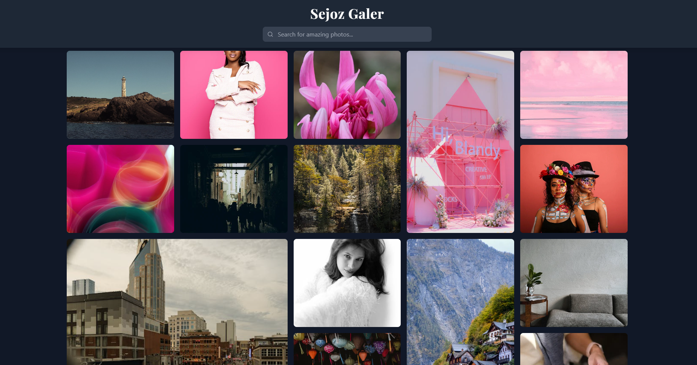

# ✨ Sejoz Galer



> 🎭 A stunning image gallery crafted with artistry and modern web technologies

## 🌈 About

Sejoz Galer is a mesmerizing image gallery that transforms the way you explore visual content. With its artistic grid layout and seamless interactions, it creates an immersive browsing experience that makes every image discovery feel special.

## 💫 Key Features

### 🎨 Artistic Grid Layout
- Dynamic mosaic-style grid with randomly sized images
- Smooth hover animations and transitions
- Responsive design that adapts to any screen size
- Beautiful floating card effects

### 🔍 Smart Search
- Instant image search with intelligent debouncing
- Real-time results as you type
- Elegant search UI with clear functionality
- Seamless loading states

### 📱 Immersive Viewing Experience
- Stunning lightbox view for detailed image exploration
- Optimized image sizing for any aspect ratio
- Sleek photographer attribution
- Smooth transitions between views

### ♾️ Infinite Exploration
- Endless scrolling for continuous discovery
- Optimized loading for performance
- Seamless content integration
- Fluid user experience

## 🛠️ Technology Stack

### 🎭 Frontend Framework
- **React** - Powers the interactive UI components
- **Tailwind CSS** - Enables sophisticated styling
- **Lucide React** - Provides beautiful iconography

### 📚 Libraries
- `react-infinite-scroll-component` - Enables seamless infinite scrolling
- `Playfair Display` font - Adds typographic elegance

### 🎯 API Integration 
- **Pexels API** - Sources high-quality images
  - Curated photos endpoint for featured content
  - Search endpoint for specific discoveries

## 🎪 UI Components

### 🎭 Gallery Grid
```css
/* Artistic grid layout */
.gallery-grid {
  display: grid;
  grid-template-columns: repeat(auto-fill, minmax(300px, 1fr));
  grid-auto-rows: 250px;
  grid-auto-flow: dense;
}

/* Random sizing magic ✨ */
.gallery-item:nth-child(4n) { grid-row: span 2; }
.gallery-item:nth-child(8n) { grid-column: span 2; }
```

### 🔍 Smart Search
```javascript
// Intelligent debouncing for optimal performance
const debouncedSearch = useCallback(
  debounce((query) => {
    setSearchQuery(query);
    setPage(1);
  }, 500),
  []
);
```

### 🖼️ Lightbox View
```javascript
// Optimized image viewing experience
<div className="lightbox-image">
  
</div>
```

## 🌟 Features Showcase

### 🎨 Dynamic Grid
- Responsive mosaic layout
- Random image sizing
- Smooth animations
- Hover effects

### 🌓 Dark Theme
- Elegant dark mode design
- Floating card effects
- Subtle gradients
- High contrast text

### 📱 Responsive Design
- Mobile-first approach
- Tablet optimization
- Desktop enhancement
- Fluid transitions

## ✨ Unique Touches

- 🎭 Artistic grid layout with random sizing
- 🌊 Smooth transitions and animations
- 👁️ Elegant image hover effects
- 🎯 Optimized image loading
- 🎨 Beautiful photographer attribution

## 💡 Tips

- 🔑 Get your Pexels API key from [Pexels API](https://www.pexels.com/api/)
- 🚀 Fork and clone to start exploring
- 🎨 Customize the grid layout to match your style
- 📱 Test on different devices for the full experience

## 🙏 Credits

- 📸 Images: [Pexels](https://www.pexels.com)
- 🎭 Font: Playfair Display by Google Fonts
- 🎯 Icons: Lucide React

## 🌈 Support

Got questions? Need help? Feel free to reach out! 💌

---

Made with 💖 and a touch of ✨ magic